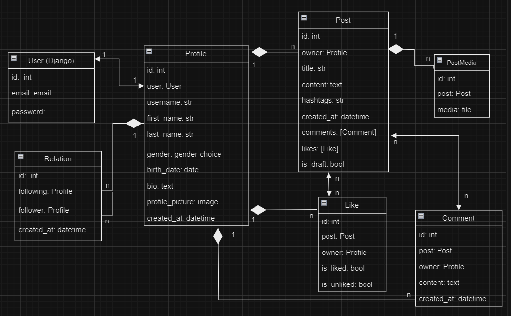

# Social Media API

## Project description:
### User Registration and Authentication:
* Users register with their email and password to create an account.
* Users can be login with their credentials and receive a token for authentication.
* Users can be logout and invalidate their token.
### User Profile:
* Users can create and update their profile, including profile picture, bio, and other details.
* Users can delete their own profile.
* Users can retrieve their own profile and view profiles of other users.
* Users can search for other users by username, first_name, last_name and birth_date.
### Follow/Unfollow:
* Users can follow and unfollow other users.
* Users can view the list of users they are following and the list of users following them.
### Post Creation and Retrieval:
* Users can create new posts with text content and media attachments (e.g., images).
* Users can retrieve their own posts and posts of other users, in particular that they are following.
* Users can retrieve posts that are liked by their.
* Users can retrieve posts by hashtags, title and content.
### Likes and Comments:
* Users can like and unlike posts. 
* Users can add comments to posts and view comments on posts.

### Schedule Post creation using Celery:
* Users have possibility to schedule Post creation (can set the time_posting of posts).
### API Permissions:
* Only authenticated users can perform actions such as creating posts, liking posts, and following/unfollowing users.
* Users can update and delete their own posts and comments.
* Users can update and delete their own profile.
### API Documentation:
* The API documentation make with Swagger drf-spectacular.

### Technologies to use:
1. Python, SQLite, Git.
2. Django and Django REST framework
3. Celery as task scheduler for time_posting.
4. Token-based authentication Django
5. Swagger drf-spectacular.

### Diagram of project:

### How to run:
* Upload project: `git clone https://github.com/zazmarga/social-media-api`
* Create venv: `python -m venv venv`
* Activate it: `venv/Scripts/activate`
* Install requirements: `pip install -r requirements.txt`
* Create .env file with variables (see env.sample)
* Run migrations: `python manage.py migrate`
* Run Redis Server: `docker run -d -p 6379:6379 redis`
* Run Celery worker for tasks handing: `celery -A social_media_api worker --pool=solo --loglevel=INFO`
* Run app: `python manage.py runserver`
* Create superuser: `python manage.py createsuperuser`
